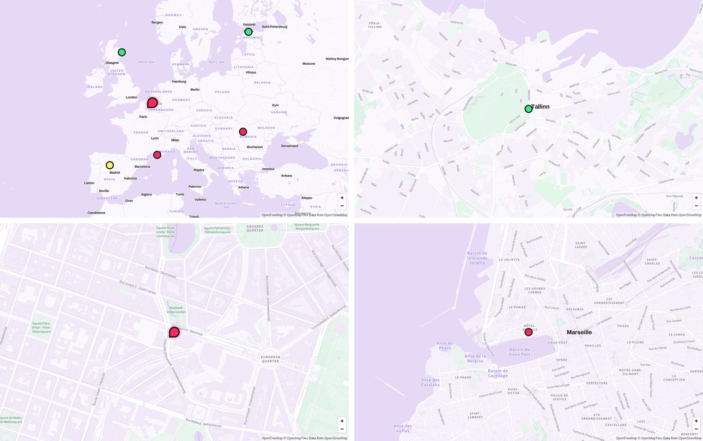

# BRICKS map style for MapLibre GL

[](LICENSE)
[](LICENSE-CODE)
[](https://doi.org/10.5281/zenodo.23219187)

A vector map style for [MapLibre GL JS](https://maplibre.org/) in the visual identity of [BRICKS](https://bricks-neb.eu/): brand palette, Archivo and Source Sans 3 labels, and pilot markers in the style of the BRICKS website.

Base map tiles come from [OpenFreeMap](https://openfreemap.org/) (OpenMapTiles schema, OpenStreetMap data). No account, no API key, no per-load cost.

**Live preview:** https://lisboncouncil.github.io/bricks-map-style/



## Quick start

Use the published style directly. Glyphs and style are served from GitHub Pages.

```html
<link rel="stylesheet" href="https://cdn.jsdelivr.net/npm/maplibre-gl@5/dist/maplibre-gl.css">
<script src="https://cdn.jsdelivr.net/npm/maplibre-gl@5/dist/maplibre-gl.js"></script>

<div id="map" style="height: 320px"></div>
<script>
  const map = new maplibregl.Map({
    container: 'map',
    style: 'https://lisboncouncil.github.io/bricks-map-style/bricks-style.json',
    center: [4.3786, 50.8433],
    zoom: 15
  });

  // A BRICKS "station" marker
  const el = document.createElement('div');
  el.style.cssText = 'width:32px;height:32px;border-radius:50%;background:#ff285e;border:4px solid #1d1d1b';
  new maplibregl.Marker({ element: el }).setLngLat([4.3786, 50.8433]).addTo(map);
</script>
```

In production, consider serving `maplibre-gl.js` and `maplibre-gl.css` from your own site instead of the CDN.

## Repository layout

| Path | What it is |
| --- | --- |
| `style/bricks-style.json` | The style (MapLibre style spec v8), with glyphs pointing to GitHub Pages |
| `fonts/` | Glyph files (PBF) for Archivo Bold, Archivo ExtraBold, Source Sans 3 Regular and Source Sans 3 SemiBold |
| `preview/index.html` | The preview page published as the site home |
| `scripts/make_style.py` | Generates the style; colours, fonts and layers are defined here |
| `scripts/instance_fonts.py` | Creates static font instances from the variable fonts |
| `scripts/gen-glyphs.js` | Turns a TTF into MapLibre glyph PBFs (uses `fontnik`) |
| `docs/preview.jpg` | Screenshot used in this README |
| `build.sh` | Builds the static site in `_site/` |
| `.github/workflows/` | Publishes to GitHub Pages on every push to `main`; validates the style on pull requests |

## Working on the style

Edit `scripts/make_style.py`, then regenerate and validate:

```bash
npm install
python3 scripts/make_style.py      # writes style/bricks-style.json
npm run validate
```

Test locally with glyphs served from your machine:

```bash
./build.sh http://localhost:8765
python3 -m http.server 8765 -d _site
# open http://localhost:8765/
```

Commit both `scripts/make_style.py` and the regenerated `style/bricks-style.json`. The pull request check fails if they are out of sync.

### Regenerating the glyphs

Only needed if fonts change. Download the variable fonts from Google Fonts ([Archivo](https://fonts.google.com/specimen/Archivo), [Source Sans 3](https://fonts.google.com/specimen/Source+Sans+3)), then:

```bash
pip install fonttools
mkdir -p ttf
python3 scripts/instance_fonts.py Archivo-VF.ttf SourceSans3-VF.ttf ttf
for f in "Archivo Bold" "Archivo ExtraBold" "Source Sans 3 Regular" "Source Sans 3 SemiBold"; do
  node scripts/gen-glyphs.js "ttf/${f// /_}.ttf" "$f" fonts
done
```

## Design notes

- **Palette.** Land `#fbf8fd`, water `#e6d9f6`, parks `#e2f6e9`, buildings `#f2eaf8`, roads white with lilac casing, country labels in violet. Derived from the BRICKS palette: lilac `#dec0f1`, violet `#7161ef`, pink `#ff285e`, green `#34ea82`, yellow `#fff35e`.
- **Labels.** English names where available (`name:en`), otherwise the local name in Latin script. Street names stay in the local language. Cities in Archivo Bold, everything else in Source Sans 3.
- **Quiet base map.** Points of interest, shop icons, road shields and one-way arrows are hidden on purpose, so that project content stands out.
- **Markers.** Colours follow the three thematic lines of the project: green for circularity (Aberdeen, Tallinn), pink for mobility (Cluj-Napoca, Marseille), yellow for energy and water (Valladolid). Event locations use a larger pink marker. Coordinates in the preview are city centres.

## Privacy

OpenFreeMap requires no account or API key and does not use tracking. GitHub Pages, which serves the style and glyphs, may log IP addresses for security purposes. Check both with your data protection officer before use.

## Attribution

The attribution "OpenFreeMap © OpenMapTiles, Data from OpenStreetMap" is required. It is set in the style source, and MapLibre shows it on the map.

## Licence

- **Style and design** (`style/`, the map design in `scripts/make_style.py`, the preview page design and this documentation): [Creative Commons Attribution 4.0 International (CC BY 4.0)](LICENSE). © The Lisbon Council 2026.
- **Code** (`scripts/`, `build.sh`, workflows, the JavaScript in `preview/index.html`): [MIT](LICENSE-CODE). © 2026 The Lisbon Council.

Suggested attribution when reusing the style: *"BRICKS map style" by The Lisbon Council, CC BY 4.0, https://github.com/lisboncouncil/bricks-map-style*

Third-party components keep their own licences:

- Glyph files in `fonts/` are derived from Archivo and Source Sans 3, both released under the [SIL Open Font License 1.1](https://openfontlicense.org/).
- Map data © [OpenStreetMap contributors](https://www.openstreetmap.org/copyright), available under the Open Database License (ODbL). Tiles by OpenFreeMap and OpenMapTiles.
- MapLibre GL JS is released under the BSD 3-Clause licence.

## Citation

See [`CITATION.cff`](CITATION.cff). Each release is archived on Zenodo with a DOI.

## Funding

BRICKS (Building Resilient Innovation in Communities through Knowledge and Social innovation) has received funding from the European Union's Horizon Europe Framework Programme under Grant Agreement No. 101309643. Views and opinions expressed are however those of the author(s) only and do not necessarily reflect those of the European Union. Neither the European Union nor the granting authority can be held responsible for them.
